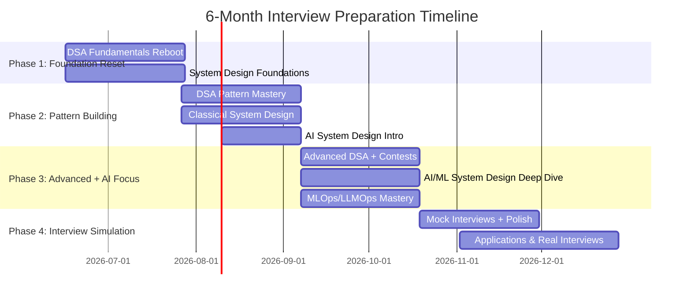

# 🎯 6-Month SDE2 Interview Masterplan — Anduri Roshan

> **Target**: SDE2 at Amazon, Google, and top-tier AI companies  
> **Timeline**: June 2026 → December 2026  
> **Current State**: ~1 year as Applied AI Engineer at Accenture, strong in LLM/RAG/agentic systems, rusty on DSA, no formal system design practice  

---

## The Real Problem (And How We Fix It)

You're not lacking intelligence — you're lacking **structure and deliberate practice**. You can build production LangGraph agents, multi-step RAG pipelines, and FastAPI backends. The interview game is a *different skill* that requires its own training. Here's the brutal truth:

| Your Strength | Your Gap |
|---|---|
| Building real AI systems at Accenture | Can't articulate design decisions under interview pressure |
| LangChain, LangGraph, RAG pipelines | Haven't practiced DSA patterns in years |
| Production ETL, Teradata, BigQuery | Never formally studied classical system design |
| Full-stack AI (FastAPI + React) | Can't answer AI system design questions like multi-tenant isolation |

**The plan below is designed for someone who loses focus.** Every week has exactly 3 things. No more. No "also read this blog." Just 3 things.

---

## 🗓️ Phase Overview



---

## 📌 Phase 1: Foundation Reset (Weeks 1–6) — June 16 → July 26

> **Goal**: Rebuild DSA muscle memory from zero. Start thinking in systems.

### 🔴 DSA: The Reboot (10 hrs/week)

You said you can't even think of simple approaches. That's because your brain lost the *pattern library*. We rebuild it from scratch.

**Week 1–2: Arrays, Strings, Hashing**
- [ ] Watch NeetCode's roadmap video (explains the method): [NeetCode Roadmap](https://neetcode.io/roadmap)
- [ ] Solve NeetCode 150 — Arrays & Hashing section (9 problems)
- [ ] Solve NeetCode 150 — Two Pointers section (5 problems)
- [ ] **Rule**: Spend max 20 min thinking. If stuck, watch NeetCode's video solution. Then re-solve from scratch next day.

**Week 3–4: Sliding Window, Stack, Binary Search**
- [ ] NeetCode 150 — Sliding Window (6 problems)
- [ ] NeetCode 150 — Stack (7 problems)
- [ ] NeetCode 150 — Binary Search (7 problems)
- [ ] Start a **pattern notebook**: For each problem, write: *Pattern Name → When to use → Template code*

**Week 5–6: Linked Lists, Trees (BFS/DFS)**
- [ ] NeetCode 150 — Linked List (11 problems)
- [ ] NeetCode 150 — Trees (15 problems)
- [ ] By now you should have ~60 problems done

> **The "Forgetting" Fix — The 3-7-15 Rule**: After solving a problem, re-solve it at **Day 3**, **Day 7**, and **Day 15**. If you nail it on Day 3, skip to Day 15. If you struggle, reset the counter. This is spaced repetition — the same technique Anki uses. Track this inside the PrepSDE DSA panel.

### 🔵 System Design: Foundations (5 hrs/week)

Don't jump into designing Twitter yet. Build vocabulary first.

- [ ] Read **System Design Primer** — these sections ONLY:
  - [How to approach a system design question](https://github.com/donnemartin/system-design-primer#how-to-approach-a-system-design-interview-question)
  - [Scalability lecture by Harvard (linked in primer)](https://github.com/donnemartin/system-design-primer#scalability-lecture)
  - Performance vs Scalability
  - Latency vs Throughput
  - CAP Theorem
  - DNS, CDN, Load Balancer, Reverse Proxy
- [ ] Watch: **Gaurav Sen** — "System Design Basics" playlist (first 10 videos)
- [ ] Make flashcards (physical or Anki) for every concept

### 🟢 Behavioral: Start Collecting Stories (1 hr/week)

- [ ] Write down 5 stories from your work using the **STAR format** (Situation, Task, Action, Result):
  1. A time you dealt with a production incident or tricky bug
  2. A time you disagreed with your team/manager
  3. A time you led a technical decision
  4. A time you had to learn something new quickly (Teradata DB manager?)
  5. A time you delivered under pressure

---

## 📌 Phase 2: Pattern Building (Weeks 7–12) — July 27 → September 6

> **Goal**: Master DSA patterns. Design your first 5 systems. Start AI system design thinking.

### 🔴 DSA: Pattern Mastery (10 hrs/week)

**Week 7–8: Graphs, Heaps/Priority Queue**
- [ ] NeetCode 150 — Heap/Priority Queue (7 problems)
- [ ] NeetCode 150 — Graphs (13 problems, focus on BFS/DFS/Topological Sort)
- [ ] Learn Union-Find (Disjoint Set) — solve 3 problems

**Week 9–10: Dynamic Programming (The Boss Fight)**
- [ ] Watch NeetCode's DP playlist first — don't jump into problems blind
- [ ] NeetCode 150 — 1-D DP (10 problems)
- [ ] NeetCode 150 — 2-D DP (8 problems, at least attempt all)
- [ ] **Key DP patterns to master**: Fibonacci-style, Knapsack, LCS, LIS, Matrix chain

**Week 11–12: Backtracking, Tries, Intervals**
- [ ] NeetCode 150 — Backtracking (9 problems)
- [ ] NeetCode 150 — Tries (3 problems)
- [ ] NeetCode 150 — Intervals (6 problems)
- [ ] NeetCode 150 — Greedy (8 problems)
- [ ] **Milestone**: You should have ~130/150 NeetCode problems done

> **By Week 12, you should be able to**: See a new medium problem, identify the pattern within 5 minutes, and code a working solution within 25 minutes.

### 🔵 System Design: Classical Systems (5 hrs/week)

Design one system per week. Follow this exact framework for each:

**The Framework** (use for every design):
```
1. Requirements (5 min): Functional vs Non-functional
2. Estimation (5 min): DAU, QPS, Storage  
3. High-Level Design (10 min): Draw the boxes
4. Deep Dive (20 min): Database schema, API design, scaling bottlenecks
5. Bottlenecks & Trade-offs (5 min): What breaks at 10x? 100x?
```

**Week 7**: Design a URL Shortener (TinyURL)
**Week 8**: Design a Rate Limiter
**Week 9**: Design a Chat System (WhatsApp)
**Week 10**: Design a News Feed (Twitter/Instagram)
**Week 11**: Design a Notification System
**Week 12**: Design a Search Autocomplete

### 🟠 Low-Level Design / OOP Design (3 hrs/week)

SDE2 interviews (especially Amazon) often include a **machine coding / LLD round**. This tests your OOP skills, SOLID principles, and design pattern knowledge.

- [ ] SOLID Principles — know each one with real examples
- [ ] Key Design Patterns: Factory, Strategy, Observer, Singleton, Builder, Adapter
- [ ] Practice designing these systems (class diagrams + code):
  - Week 7: Parking Lot System
  - Week 8: Library Management System
  - Week 9: Elevator System
  - Week 10: Snake & Ladder Game
  - Week 11: Splitwise (expense sharing)
  - Week 12: Online Book Reader

### 🟡 AI System Design: Introduction (3 hrs/week, starting Week 9)

This is YOUR differentiator. Most SDE2 candidates can't talk about AI systems. You CAN.

- [ ] Read: [Chip Huyen — "Designing Machine Learning Systems"](https://www.oreilly.com/library/view/designing-machine-learning/9781098107956/) — Chapters 1-4
- [ ] Study this architecture and be able to whiteboard it:
  ```
  User Query → API Gateway → Auth/Rate Limit → LLM Orchestrator
       → Vector Store (embeddings) → LLM (with guardrails)
       → Response Filter → Logging/Monitoring → User
  ```
- [ ] Write up how YOUR Accenture RAG system works as if explaining it in an interview

---

## 📌 Phase 3: Advanced + AI Focus (Weeks 13–18) — September 7 → October 18

> **Goal**: Tackle hard problems. Master AI system design. Learn MLOps/LLMOps deeply.

### 🔴 DSA: Advanced & Speed (8 hrs/week)

- [ ] Complete remaining NeetCode 150 problems
- [ ] Start **LeetCode weekly contests** (every Saturday/Sunday) — this builds time pressure tolerance
- [ ] Revisit all problems you couldn't solve in Phase 2
- [ ] Practice: Solve 2 medium problems daily in under 30 min each

### 🔵 AI/ML System Design: Deep Dive (8 hrs/week)

#### Topic 1: Multi-Tenant Vector Store Pipeline

```
┌─────────────────────────────────────────────────────┐
│                 INGESTION PIPELINE                   │
│  Doc → Chunking → Embedding → Tenant-Tagged Index   │
│                                                      │
│  Key Decisions:                                      │
│  • Separate index per tenant vs shared index +       │
│    metadata filtering                                │
│  • Namespace isolation (Pinecone namespaces,         │
│    Weaviate tenants, Milvus partitions)              │
│  • Embedding model: shared vs per-tenant fine-tuned  │
└─────────────────────────────────────────────────────┘

┌─────────────────────────────────────────────────────┐
│                 RETRIEVAL PIPELINE                    │
│  Query → Tenant Auth → Scoped Search → Post-filter  │
│                                                      │
│  Isolation Layers:                                   │
│  1. Auth Layer: JWT with tenant_id claim             │
│  2. Query Layer: Mandatory tenant filter injection   │
│  3. Index Layer: Namespace/partition isolation        │
│  4. Post-retrieval: Validate all results belong to   │
│     requesting tenant                                │
│  5. Audit: Log every cross-tenant access attempt     │
└─────────────────────────────────────────────────────┘
```

- [ ] Build a small demo: Multi-tenant RAG with Milvus partitions + FastAPI
- [ ] Study Pinecone's namespace isolation model
- [ ] Study Weaviate's multi-tenancy architecture

#### Topic 2: Agentic AI System Design

| Pattern | When to Use | Example |
|---|---|---|
| ReAct (Reasoning + Action) | Single agent, tool calling | Your LangGraph chatbot at Accenture |
| Plan-then-Execute | Complex multi-step tasks | Research agent that plans → searches → synthesizes |
| Multi-Agent Orchestration | Different specialized roles | Crew of agents: Researcher, Coder, Reviewer |
| Human-in-the-Loop | High-stakes decisions | Financial approval workflows |

**Key safety concepts for agentic systems**:
- [ ] Tool call authorization (whitelist allowed tools per context)
- [ ] Prompt injection defenses (input sanitization, output filtering, separate system/user contexts)
- [ ] Privileged tool isolation (admin tools in separate namespace, require explicit escalation)
- [ ] Memory isolation (per-tenant conversation stores, TTL on sensitive data, scrub PII before storage)
- [ ] Guardrails (output validation, token budget limits, recursion depth limits)

#### Topic 3: Production LLM Architecture

- [ ] Study and be able to whiteboard:
  - LLM Gateway pattern (routing, load balancing across models)
  - Caching strategies (semantic cache with embeddings, exact match cache)
  - Evaluation pipelines (offline evals, A/B testing, human-in-the-loop)
  - Cost optimization (model routing: cheap model for simple queries, expensive for complex)
  - Observability (LangSmith, Langfuse, Phoenix for tracing)

---

## 📌 Phase 4: Interview Simulation (Weeks 19–24) — October 19 → November 30

> **Goal**: Simulate real interviews. Apply to companies. Close offers.

### Mock Interviews (10 hrs/week)

- [ ] **DSA Mocks**: Do 3 timed mock interviews per week (Pramp, interviewing.io)
- [ ] **System Design Mocks**: Do 2 per week (Talk out loud for 35-40 minutes)
- [ ] **AI System Design Mocks**: Do 1 per week (Enterprise search RAG, AI code reviewer, multi-model gateway)

### Application Strategy

| Tier | Companies | Why This Order |
|---|---|---|
| Practice tier | Smaller AI startups, mid-tier companies | Get real interview experience, lower stakes |
| Target tier | Microsoft, Meta, Uber | Good SDE2 opportunities, reasonable bar |
| Reach tier | Amazon, Google | Highest bar, apply when you're sharpest |

- [ ] Update resume to emphasize: Scale numbers, AI/LLM system design decisions, production ownership.
- [ ] Start applying to practice-tier companies by Week 20
- [ ] Apply to target/reach companies by Week 22

---

## 🎯 Answering the micro1 Questions You Failed

### Q: "When would you re-raise vs wrap an exception?"
> "Re-raise when the caller can meaningfully handle the original error type — for example, a transient `ConnectionError` where upstream code has retry logic. Wrap in a custom type when you need to (1) add context like which tenant or pipeline stage failed, (2) maintain a clean abstraction boundary so internal implementation details don't leak, or (3) translate vendor-specific errors into your domain's error taxonomy. In a production AI platform, I'd wrap most errors into domain types like `EmbeddingGenerationError` or `RetrievalTimeoutError` so the orchestrator can route to appropriate fallback strategies."

### Q: "Design a multi-tenant vector store pipeline"
> Start with ingestion: documents go through chunking → embedding → storage with mandatory `tenant_id` tagging. For isolation, I'd use **namespace-per-tenant** (Pinecone) or **partition-per-tenant** (Milvus) rather than shared indexes with metadata filters, because a single metadata filter is a single point of failure — one bug and you leak data.
>
> At query time, the tenant scope is enforced at THREE layers: (1) API gateway validates JWT and extracts `tenant_id`, (2) the retrieval service uses a middleware that injects tenant constraint before any query executes — the query literally cannot run without it (like row-level security in Postgres), (3) post-retrieval validation checks every returned document's `tenant_id` matches.
>
> For admin/cross-tenant access: separate privileged workflow with its own auth path, explicit audit logging, and the agent can NEVER invoke it — only a human-authorized API call with MFA can trigger cross-tenant queries.

### Q: "Agent memory design to prevent data leakage"
> Three memory types, three isolation strategies:
> 1. **Conversation memory**: Scoped to `(tenant_id, session_id)`. TTL-based expiry. PII scrubbed before storage.
> 2. **Long-term memory**: Tenant-isolated vector store. Embeddings NEVER cross tenant boundaries.
> 3. **Tool results**: Ephemeral by default — stored only for current session, then purged. If persisted, encrypted at rest with tenant-specific keys.
>
> Additional safeguards: System prompts explicitly instruct the model to never reference previous tenant contexts. Output filters scan for PII patterns before returning responses. All memory operations are logged to an immutable audit trail.
