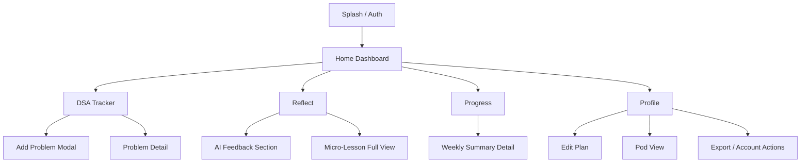

# PrepSDE — Mobile App UI Plan

> For use by a UI agent. Mobile-first (Flutter or React Native). Dark theme. Glassmorphic.

---

## Navigation Structure

**Bottom Tab Bar (5 tabs):**

| Tab | Icon | Label | Purpose |
|-----|------|-------|---------|
| 1 | 🏠 | Home | Dashboard — deadline, streak, today's tasks, pace |
| 2 | 💻 | DSA | DSA tracker, problem log, spaced repetition queue |
| 3 | 📝 | Reflect | Daily reflection journal + AI feedback |
| 4 | 📈 | Progress | Heatmap, analytics, weekly summaries |
| 5 | 👤 | Profile | Settings, plan config, account, pod |

---

## Page-by-Page Breakdown

---

### 1. Home (Dashboard)

The first thing the user sees. Should answer: "What do I need to do today, and am I on track?"

**Layout (top to bottom):**

```
┌─────────────────────────────────┐
│  "Hey Roshan" + avatar (small)  │  ← greeting, top-left
│  🔥 12-day streak              │  ← top-right badge
├─────────────────────────────────┤
│  ┌───────────────────────────┐  │
│  │  DEADLINE CARD (large)    │  │
│  │  "87 days left"           │  │
│  │  Target: Dec 15, 2026     │  │
│  │  Status: 🟢 On Track     │  │
│  │  (or 🔴 -2 days penalty)  │  │
│  └───────────────────────────┘  │
├─────────────────────────────────┤
│  TODAY'S TASKS (checklist)      │
│  ☐ Solve NeetCode — Stack (7)  │
│  ☐ Read: Caching & CDNs        │
│  ☐ Write STAR story #4         │
│  ─ ─ ─ ─ ─ ─ ─ ─ ─ ─ ─ ─ ─   │
│  "3 tasks remaining"           │
├─────────────────────────────────┤
│  WEEKLY PACE (compact bar)      │
│  Problems: ████████░░ 8/10     │
│  Sys Design: ██████░░░░ 3/5   │
│  Reflections: ██████████ 5/5  │
├─────────────────────────────────┤
│  SPACED REPETITION DUE         │
│  "2 problems due for review"   │
│  → Two Sum (Day 7 review)      │
│  → Valid Parentheses (Day 15)  │
└─────────────────────────────────┘
```

**Interactions:**
- Tap deadline card → expands to show timeline + adjustment history
- Tap a task → marks complete (with haptic feedback)
- Tap a review problem → opens problem detail with link to LeetCode

---

### 2. DSA Tracker

Where the user logs problems and manages spaced repetition.

**Layout:**

```
┌─────────────────────────────────┐
│  [Search bar]  [+ Add Problem]  │
├─────────────────────────────────┤
│  TABS: All | Due Today | Mastered│
├─────────────────────────────────┤
│  FILTER CHIPS (scrollable):     │
│  [Arrays] [Two Pointers] [Stack]│
│  [Trees] [Graphs] [DP] [...]   │
├─────────────────────────────────┤
│  PROBLEM LIST                   │
│  ┌───────────────────────────┐  │
│  │ Two Sum          Easy 🟢 │  │
│  │ Pattern: Hashing          │  │
│  │ Next review: Tomorrow     │  │
│  │ Reviews: ●●○ (2/3 done)  │  │
│  └───────────────────────────┘  │
│  ┌───────────────────────────┐  │
│  │ Valid Parentheses Med 🟡  │  │
│  │ Pattern: Stack            │  │
│  │ Next review: Jun 18       │  │
│  │ Reviews: ●○○ (1/3 done)  │  │
│  └───────────────────────────┘  │
│  ... (scrollable list)          │
├─────────────────────────────────┤
│  STATS BAR (sticky bottom)      │
│  Total: 42 | Mastered: 12      │
│  NeetCode 150: 42/150          │
└─────────────────────────────────┘
```

**Add Problem Modal:**
- Problem name (text input)
- Link (URL input, optional)
- Difficulty (Easy / Medium / Hard — pill selector)
- Pattern (dropdown or chip multi-select: Arrays, Two Pointers, Sliding Window, Stack, Binary Search, Linked List, Trees, Graphs, Heap, DP, Backtracking, Tries, Greedy, Intervals, Bit Manipulation)
- Solved independently? (Yes / No / Partially)
- Notes (multiline text)
- [Save] button

**Problem Detail Page (tap a problem):**
- All logged info
- Review timeline visualization (Day 3 → Day 7 → Day 15 → Mastered)
- "Mark Review Complete" button (or "I struggled" to reset timer)
- Open in LeetCode button (external link)

---

### 3. Reflect (Daily Reflection Journal)

One reflection per day. This is where the AI interaction lives.

**Layout:**

```
┌─────────────────────────────────┐
│  TODAY: June 13, 2026           │
│  (or select past date)          │
├─────────────────────────────────┤
│  HOW WAS TODAY? (rating)        │
│  😫  😐  🙂  😊  🔥            │
│   1   2   3   4   5            │
├─────────────────────────────────┤
│  WHAT DID YOU ACCOMPLISH?       │
│  ┌───────────────────────────┐  │
│  │ (multiline text input)    │  │
│  │                           │  │
│  └───────────────────────────┘  │
├─────────────────────────────────┤
│  WHAT DID YOU STRUGGLE WITH?    │
│  ┌───────────────────────────┐  │
│  │ (multiline text input)    │  │
│  └───────────────────────────┘  │
├─────────────────────────────────┤
│  PLAN FOR TOMORROW?             │
│  ┌───────────────────────────┐  │
│  │ (multiline text input)    │  │
│  └───────────────────────────┘  │
├─────────────────────────────────┤
│  [Submit Reflection]            │
├─────────────────────────────────┤
│                                 │
│  ── AI COACH FEEDBACK ──        │
│  (appears after submit)         │
│                                 │
│  Verdict: 🟢 Deep Work          │
│  "Nice work today Roshan..."    │
│                                 │
│  📖 MICRO-LESSON (if 🔴):      │
│  "How Uber handles rate..."     │
│  [Read More →]                  │
│                                 │
├─────────────────────────────────┤
│  PAST REFLECTIONS (scrollable)  │
│  Jun 12 — 🟡 Surface           │
│  Jun 11 — 🟢 Deep Work         │
│  Jun 10 — 🔴 Lazy              │
└─────────────────────────────────┘
```

**Interactions:**
- Rating selector — emoji tap, no text needed
- Submit → triggers the AI call (or rule-based pre-screen)
- AI feedback section slides in with a subtle animation
- Micro-lesson card expandable inline or links to a full-page article view
- Tap past reflection → read-only view with that day's AI feedback

---

### 4. Progress (Analytics)

The data nerd page. Weekly summaries + heatmap + trends.

**Layout:**

```
┌─────────────────────────────────┐
│  PHASE PROGRESS BAR             │
│  Phase 1 ████████░░ Week 4/6   │
│  (gate: 60 problems + 4 weeks) │
├─────────────────────────────────┤
│  ACTIVITY HEATMAP               │
│  (GitHub-style grid, 12 weeks)  │
│  Mon ░░█░█░██░█░░█░█░░░░░█░░  │
│  Tue ░█░░█░█░█░░░█░░█░░░░░░░  │
│  ...                            │
│  Legend: None / Light / Medium  │
├─────────────────────────────────┤
│  WEEKLY SUMMARIES (cards list)  │
│  ┌───────────────────────────┐  │
│  │ Week 4 (Jun 9–15)        │  │
│  │ Problems: 11 | SD: 3     │  │
│  │ Avg reflection: 🟡       │  │
│  │ Deadline change: none     │  │
│  └───────────────────────────┘  │
│  ┌───────────────────────────┐  │
│  │ Week 3 (Jun 2–8)         │  │
│  │ Problems: 8 | SD: 2      │  │
│  │ Avg reflection: 🟡       │  │
│  │ Deadline: +1 day          │  │
│  └───────────────────────────┘  │
├─────────────────────────────────┤
│  TOPIC MASTERY (horizontal bars)│
│  Arrays      ████████████ 100% │
│  Two Pointers████████░░░  75%  │
│  Stack       ██████░░░░░  55%  │
│  Trees       ███░░░░░░░░  25%  │
│  Graphs      ░░░░░░░░░░░   0% │
├─────────────────────────────────┤
│  REFLECTION TREND (line chart)  │
│  (x = days, y = 1-5 rating)    │
│  Shows AI verdict dots colored  │
└─────────────────────────────────┘
```

---

### 5. Profile

Settings, plan configuration, account management, pod info.

**Layout:**

```
┌─────────────────────────────────┐
│  AVATAR + NAME                  │
│  [Roshan]                       │
│  roshananduri@gmail.com         │
│  Member since Jun 2026          │
├─────────────────────────────────┤
│  YOUR PLAN                      │
│  Target: SDE2                   │
│  Duration: 24 weeks             │
│  Start: Jun 16, 2026            │
│  Current Deadline: Dec 15       │
│  Adjustments: +3 / -1 days     │
│  [Edit Plan →]                  │
├─────────────────────────────────┤
│  ACCOUNTABILITY POD             │
│  Pod: "DSA Grinders" (4 people) │
│  This week's leader: Priya 🔥  │
│  [View Pod →]                   │
├─────────────────────────────────┤
│  NOTIFICATIONS                  │
│  Daily reminder: 9:00 PM  [✓]  │
│  Weekly summary: Sunday   [✓]  │
│  Pod updates:             [✓]  │
├─────────────────────────────────┤
│  SETTINGS                       │
│  Theme: Dark (locked for now)   │
│  [Export Data]                   │
│  [Log Out]                      │
│  [Delete Account]               │
└─────────────────────────────────┘
```

---

## Shared Components

| Component | Usage |
|-----------|-------|
| **Deadline Card** | Home (large), Profile (compact) |
| **Problem Card** | DSA list, Home (review due), Progress (mastery) |
| **Reflection Card** | Reflect (past list), Progress (weekly summary) |
| **Pace Bar** | Home (compact), Progress (detailed) |
| **Phase Indicator** | Home (subtle), Progress (full bar), Profile |
| **Streak Badge** | Home (top-right), Profile |
| **Chip/Pill** | Pattern filters, difficulty tags, phase labels |
| **Empty State** | Each tab's default when no data exists yet |
| **Loading Skeleton** | While fetching data from Firestore |
| **Toast/Snackbar** | Confirmations ("Problem logged!", "Reflection saved!") |

---

## Design Tokens (Reference)

```
Background:     #06060a (primary), #0f0f14 (surface/cards)
Glass:          rgba(255,255,255,0.03) bg + 1px border rgba(255,255,255,0.06)
Accent:         #6366f1 (indigo — primary actions, links)
Success:        #10b981
Warning:        #f59e0b
Danger:         #ef4444
Text Primary:   #f1f5f9
Text Muted:     #64748b
Font:           Inter (400/500/600/700)
Spacing:        4px base (4/8/12/16/24/32/48)
Radius:         8px (cards), 12px (modals), 9999px (pills/chips)
```

---

## Screen Flow



---

## Onboarding Flow (First-Time User)

1. **Sign in** — Google one-tap
2. **Set your target** — "What role are you preparing for?" (SDE1 / SDE2 / Senior / Staff)
3. **Set your timeline** — "How many months do you have?" (slider: 3–12 months)
4. **Select your start date** — defaults to today
5. **Pick your focus** — checkboxes: DSA, System Design, LLD, AI/ML Design, Behavioral
6. **Done** → lands on Home with tasks generated from the plan

---

## Key UX Rules

- No page should require more than 2 taps to reach from the home tab
- Deadline card is ALWAYS visible on home — the most important number
- Haptic feedback on completing tasks and submitting reflections
- AI feedback never blocks the UI — show a subtle loading state, then animate in
- Empty states should have a clear CTA ("Log your first problem", "Write today's reflection")
- Pull-to-refresh on all list views
- Offline indicator banner at top when no connection (data still readable from cache)
